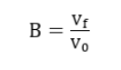
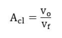
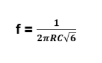
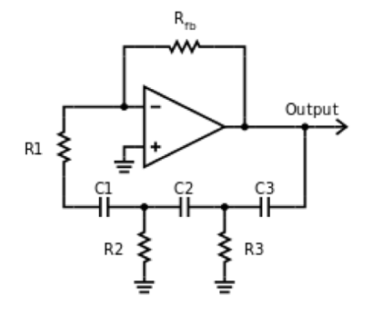
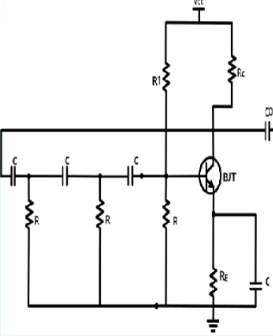

### Theory

**1. RC Phase shift oscillator using Op-AMP**

A phase-shift oscillator is a linear electronic oscillator circuit that produces a sine wave output. It consists of an inverting amplifier element, such as a transistor or op-amp, with its output fed back to its input through a phase-shift network consisting of resistors and capacitors in a ladder network. The feedback network 'shifts' the phase of the amplifier output by 180 degrees at the oscillation frequency to give positive feedback. Phase-shift oscillators are often used at an audio frequency as audio oscillators.

In this experiment, an operational amplifier is used to build the oscillator. The resistances Rfb and R1 are the input and feedback resistances of the inverting amplifier, while R1-R3 and C1-C3 form the phase shift feedback network.

The feedback factor B, defined for the feedback network, is given by

where vf is the output voltage of the feedback section and vo is the input voltage to the feedback section. One can also define a closed-loop gain ACL, which is given by,

It can be shown that for a phase shift of 180&deg;, the feedback factor must always be 1/29. This also implies that the close-loop gain must be at least 29. If this closed-loop gain is made less than this, the oscillator will not oscillate and will not produce a sinusoidal output. For a closed loop gain slightly larger than 29, the oscillator can give a reasonably pure sinusoid.

If R2 = R3 = R, and C1 = C2 = C3 = C, the oscillation frequency of the oscillator can be shown to be given by,

**2. Rc Phase shift oscillator using BJT**

The RC phase shift oscillator using BJT consists of three identical RC sections connected in series with a common emitter amplifier. Each RC section consists of a resistor and a capacitor. The capacitors are connected in series and the resistors are connected in parallel. The basic working principle of the circuit is based on the phase shift created by the RC network. Each RC section shifts the phase of the signal by 60 degrees, resulting in a total phase shift of 180 degrees. The amplifier provides an additional 180 degrees of phase shift, resulting in a total phase shift of 360 degrees, which is equivalent to zero phase shift. The BJT transistor is biased in the active region, with its base-emitter junction forward-biased and collector-base junction reverse-biased. The input signal is applied to the base of the transistor through a coupling capacitor. The transistor amplifies the signal and the output is taken from the collector of the transistor through a resistor. The resistor connected to the collector provides the feedback required for oscillation. The feedback signal is fed back to the input through the RC network, which provides the necessary phase shift to sustain oscillation. The frequency of oscillation can be calculated using the following formula:

f = 1 / (2πRC√6)

where f is the frequency of oscillation, R is the resistance of each resistor in the RC network, and C is the capacitance of each capacitor in the RC network.
The RC phase shift oscillator using BJT is a simple and inexpensive circuit that can be used in a variety of applications, including audio and RF circuits. However, the circuit has a tendency to generate higher harmonic frequencies, which can cause distortion in the output waveform. Therefore, the circuit is usually designed to operate at frequencies below 10 MHz.

